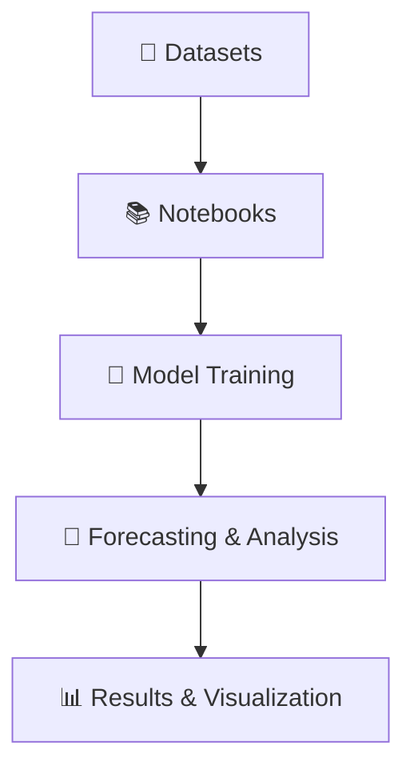

<!-- Banner -->
<p align="center">
  
  
  
</p>

<h1 align="center">⏳ Time Series Analysis Playground</h1>
<p align="center">
  <b>Explore, analyze, and forecast time-series data with classic and modern techniques!</b>
</p>

---

## 🗂️ Project Structure

<details>
<summary><b>Click to expand folder tree</b></summary>

```
Time-Series/
├── 📒 ARIMA intro.ipynb
├── 📒 ARMA and ARIMA models.ipynb
├── 📒 date-time-index.ipynb
├── 📒 general_forecasting_models.ipynb
├── 📒 keras and RNN project.ipynb
├── 📒 keras.ipynb
├── 📄 LICENSE
├── 🤖 my_rnn_model.keras
├── 📄 README.md
├── 📒 SARIMA.ipynb
├── 📒 StatsModels-time-analysis.ipynb
├── 📒 VAR models.ipynb
└── 📁 CSVs/
    ├── ✈️ airline_passengers.csv
    ├── 🍺 Alcohol_Sales.csv
    ├── 🌱 co2_mm_mlo.csv
    ├── 👶 DailyTotalFemaleBirths.csv
    ├── 💵 M2SLMoneyStock.csv
    ├── 📊 macrodata.csv
    ├── 🛒 PCEPersonalSpending.csv
    ├── 🍽️ RestaurantVisitors.csv
    ├── 🧪 samples.csv
    ├── ☕ starbucks.csv
    ├── 📦 TradeInventories.csv
    └── 👥 uspopulation.csv
```
</details>

---

## 📚 Notebooks Overview

| Notebook | Description |
|:---|:---|
|  **ARIMA intro.ipynb** | Introduction to ARIMA models for time-series forecasting. |
|  **ARMA and ARIMA models.ipynb** | Deep dive into ARMA & ARIMA, with hands-on examples. |
|  **date-time-index.ipynb** | Working with pandas DateTimeIndex for time-series data. |
|  **general_forecasting_models.ipynb** | Overview of various forecasting models and their applications. |
|  **keras and RNN project.ipynb** | Building RNNs for time-series forecasting using Keras. |
|  **keras.ipynb** | Experiments with deep learning models for sequence prediction. |
|  **SARIMA.ipynb** | Seasonal ARIMA (SARIMA) modeling and analysis. |
|  **StatsModels-time-analysis.ipynb** | Time-series analysis with StatsModels. |
|  **VAR models.ipynb** | Vector AutoRegression (VAR) for multivariate time-series. |

---

## 📁 Datasets

| File | Description |
|:---|:---|
| ✈️ **airline_passengers.csv** | Monthly airline passenger numbers. |
| 🍺 **Alcohol_Sales.csv** | US alcohol sales data. |
| 🌱 **co2_mm_mlo.csv** | Monthly CO₂ measurements at Mauna Loa. |
| 👶 **DailyTotalFemaleBirths.csv** | Daily female births in California. |
| 💵 **M2SLMoneyStock.csv** | US M2 money stock data. |
| 📊 **macrodata.csv** | Macroeconomic indicators dataset. |
| 🛒 **PCEPersonalSpending.csv** | US personal consumption expenditures. |
| 🍽️ **RestaurantVisitors.csv** | Restaurant visitor counts. |
| 🧪 **samples.csv** | Sample time-series data for testing. |
| ☕ **starbucks.csv** | Starbucks store data. |
| 📦 **TradeInventories.csv** | US trade inventories. |
| 👥 **uspopulation.csv** | US population data. |

---

## 🤖 Model Files

- **my_rnn_model.keras**  
   Pre-trained RNN model for time-series forecasting.

---

## 🗺️ Project Workflow



---

## 🚀 Quick Start

1. **Clone the repository:**
   ```bash
   git clone https://github.com/yourusername/Time-Series.git
   ```
2. **Open notebooks in Jupyter or VS Code.**
3. **Install dependencies:**
   ```bash
   pip install -r requirements.txt
   ```
4. **Start exploring and forecasting!**

---

## 🙌 Contributing

Pull requests and issues are welcome!  
Feel free to fork and experiment with new models and datasets.

---

## 📜 License

This project is licensed under the [GNU GPL v3.0](LICENSE).

---

<p align="center">
  <b>Happy Forecasting!</b> <br>
  
</p>
